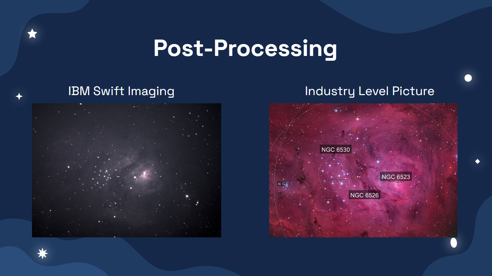
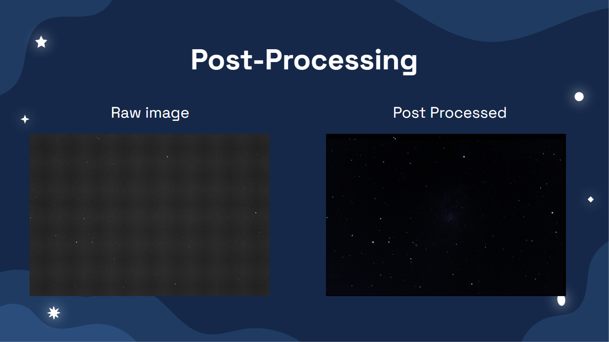
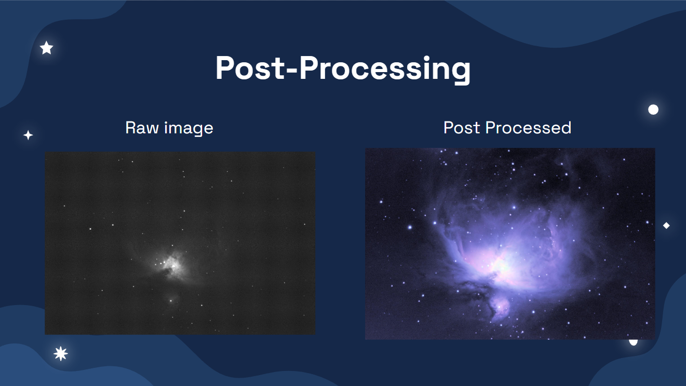
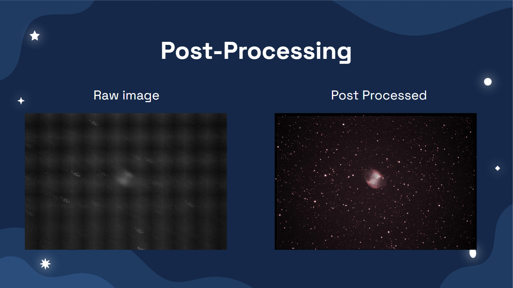
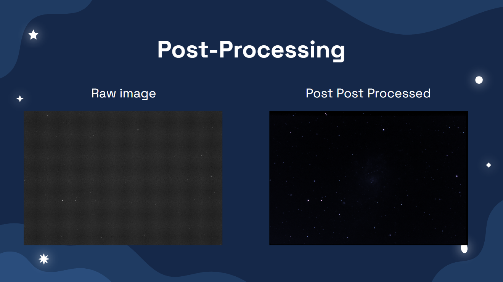

# Telescope Image Processing

## Description: 
Telescope Image Processing is a sophisticated code specifically developed to enhance and process raw image files captured by telescopes, ultimately producing a single, exceptional quality image. This code, written in Swift, is primarily designed to operate on macOS, providing astronomers and enthusiasts with powerful image processing capabilities.

By utilizing advanced algorithms and image enhancement techniques, the Telescope Image Processing code brings out intricate details and optimizes the visual clarity of astronomical images. Whether it's capturing distant galaxies, nebulae, or other celestial objects, this software employs cutting-edge techniques to improve the overall image quality, making it suitable for scientific analysis or aesthetic appreciation.

The code's architecture is designed with scalability in mind, with future plans to extend its compatibility to padOS and iOS platforms. This expansion will enable users to conveniently process telescope images on their iPads and iPhones, enhancing the accessibility and versatility of the code.

With Telescope Image Processing, astronomers and astrophotographers can unlock the true potential of their telescopes by transforming raw data into stunning visual representations of the cosmos.

## Instructions:
Clone the repository
Ensure package dependencies are installed:
- CorePlot release-2.4 (http://github.com/core-plot/core-plot)
- FITSCore fitskit-advanced
- FITSKit advanced
- swift-numerics 0.1.0
- Build

## Use:
Various options in the top bar will allow for various aspects of image processing. The various methods and suggested order is outlined below

To open an image simply select at .fits file from the inital popup of the program, or use file-open

** Calibration **
- Make Dark
    - First step
    - Summs a bunch of dark files to improve signal
- Subtract Dark
    - Second step
    - Subtract dark image from the raw data files
- Make Flat
    - Makes a flat file
    - Upload dark corrected flat files
        - Make dark
        - Subtract dark from flat files
        - Then use make flat

** Find Stars **
- Run on any grey-scale image to locate star positions
- Populates the stars in the tabs of the open image

** Extract Color **
- Extract Color
    - Takes in a (???? raw ????) .fits image file and separates it into the red, blue, green, and luminance portions
    - Saves to Pictures Folder (IS this something I did or a consistant default???)
- Combine Color Images
    - Open one image of each red, blue, green, and luminance
        - Produces high quality image when uses images that have been added (this should be last step)
    - Press 'Populate Images'
    - Select each file type in the drop-downs
    - Press 'Make The Color Image'
    - Save PNG

** Mathematics **
- Rotate and Translate
    - To be implemented
- Add Images
    - Takes a series of images in the .fits file format and summs the contribution of each pixel if it is within 1.5 standard deviations of the mean value for that site
    - First use the 'Select Files to Combine' button to select the images you want added
    - Then press 'Merge Selected Files'
    - At end press 'Save' and name the .fits file produced
    - Use File-Open to open the new file
    

** Align Images **
- Align Images
    - Probably doesn't work
- Align Color Images
    - Automatically rotates and translates images
    - Select a primary luminance file
    - Select all luminance, red, green, and blue files (including the primary luminance)
    - Saves the aligned version of every file

## Images Output 

## Credits:
IBM for colaboration
IIT IPRO curriculm and Professor Jeff Terry
Various groups of students who contributed to the project during their IPRO course

